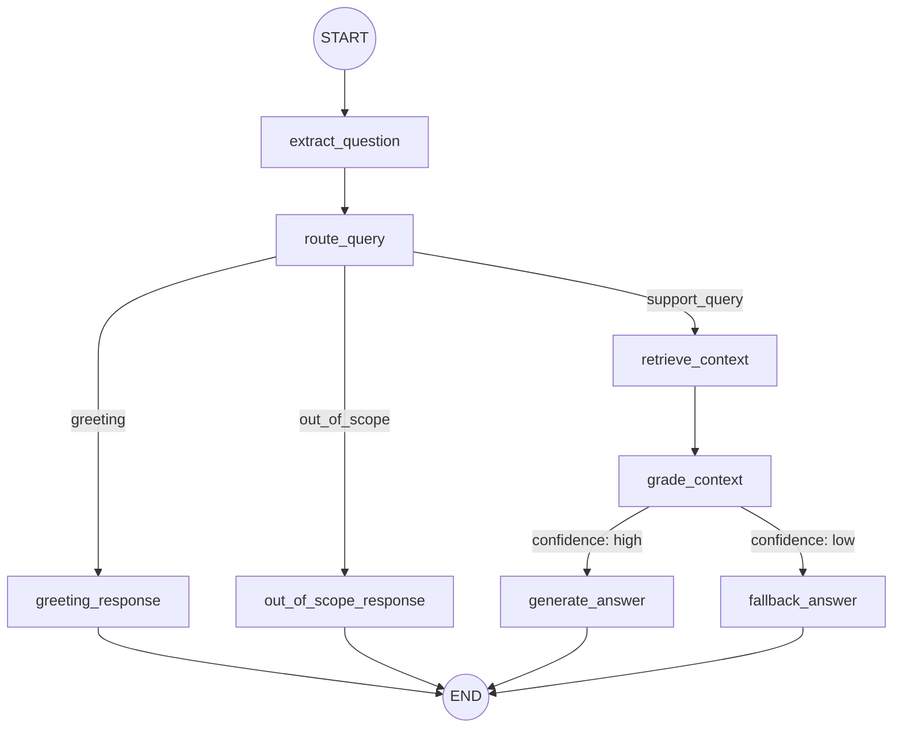

# Support Chatbot Architecture & Execution Flow

This guide breaks down the architecture and execution flow of the MicroDegree Support Chatbot. It is designed to help you understand how the Retrieval-Augmented Generation (RAG) system and the agentic workflow operate end-to-end.

The system is composed of two main operational phases:
1.  **Data Ingestion (Offline):** Processing and storing documents.
2.  **Interactive Chat (Online):** The user interface and the LangGraph agent logic.

---

## 1. The Data Ingestion Flow (`src/ingest.py`)

Before the chatbot can answer any questions, it must first "learn" the domain knowledge. This happens offline via the ingestion script.

### Step-by-step Process:
1.  **Initialization:** The `ingest_data` function begins by preparing the environment. If the `--reindex` flag is provided, it deletes any existing ChromaDB vector store to start fresh.
2.  **Document Loading:** Using LangChain's `DirectoryLoader` and `TextLoader`, the script scans the `data/` directory and loads the text from all Markdown (`.md`) files.
3.  **Text Splitting:** Large documents are difficult for AI models to process all at once. The `RecursiveCharacterTextSplitter` breaks these documents down into smaller, manageable "chunks" (based on `CHUNK_SIZE` and `CHUNK_OVERLAP` defined in `src/config.py`).
4.  **Embedding and Storing:** These text chunks are converted into numerical representations (vectors) using `OpenAIEmbeddings`. Finally, they are saved locally in a `Chroma` vector database, which enables rapid similarity searching later.

---

## 2. The Interactive Chat Flow (`app.py`)

This file is the Streamlit web application. It acts as the front-end interface, connecting the human user to the backend LangGraph agent.

### Step-by-step Process:
1.  **Setup & Validation:** Streamlit initializes the UI components. It performs a safety check to ensure the ChromaDB database exists (prompting you to run the ingestion script if it's missing). It also initializes a unique `thread_id` to keep track of the conversation memory.
2.  **User Input:** The app captures the user's question via the `st.chat_input` component.
3.  **Graph Invocation:** The user's question is wrapped in a `HumanMessage` and sent to the compiled LangGraph application (`app.invoke()`). The `thread_id` is passed along so the agent knows the context of previous messages.
4.  **Rendering:** Once the LangGraph agent finishes its reasoning and processing, Streamlit extracts the final `answer` from the agent's state and renders it on the chat screen.

---

## 3. The LangGraph Agent Flow (`src/graph.py`)

When `app.py` passes the user's question into the backend, a state-machine execution flow takes over. This is the core "brain" of the chatbot.

### Node-by-Node Breakdown:
1.  **`extract_question`**: Pulls the raw text of the user's latest question from the ongoing message history.
2.  **`route_query`**: Evaluates the question to determine the most efficient path. 
    *   If the question is a simple greeting or clearly out-of-scope (e.g., questions about sports or politics), it routes the flow directly to a hardcoded response, bypassing expensive LLM calls.
    *   If it's a valid support question, it routes to the retrieval step.
3.  **`retrieve_context`**: Connects to the ChromaDB created during the Data Ingestion phase and retrieves chunks of text that are semantically related to the user's question.
4.  **`grade_context`**: Passes the retrieved text chunks and the user's question to a dedicated LLM grader (`src/grader.py`). The LLM evaluates if the retrieved documents *actually* contain the answer.
    *   If **Yes**, it sets confidence to `high`.
    *   If **No**, it sets confidence to `low`.
5.  **Conditional Answer Generation**:
    *   If confidence is **high**, the `generate_answer` node uses a primary LLM (like `gpt-3.5-turbo`) to craft a helpful, context-aware response using *only* the retrieved information.
    *   If confidence is **low**, the `fallback_answer` node provides a safe, pre-written response directing the user to contact MicroDegree directly. This strict constraint prevents the bot from guessing or hallucinating incorrect answers.
